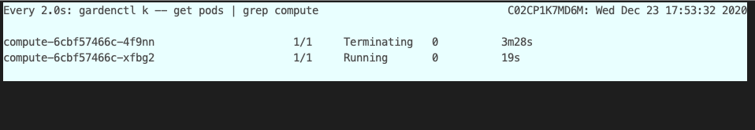
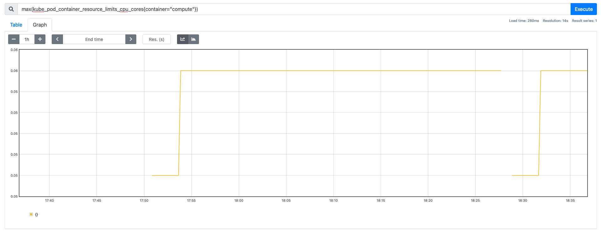
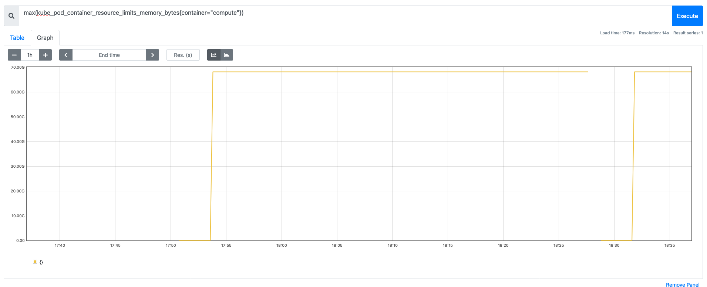
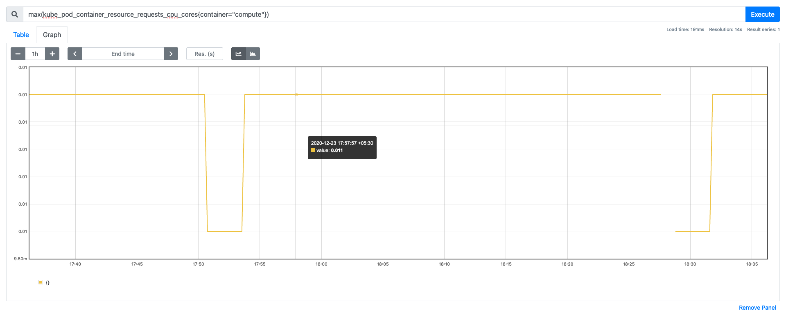
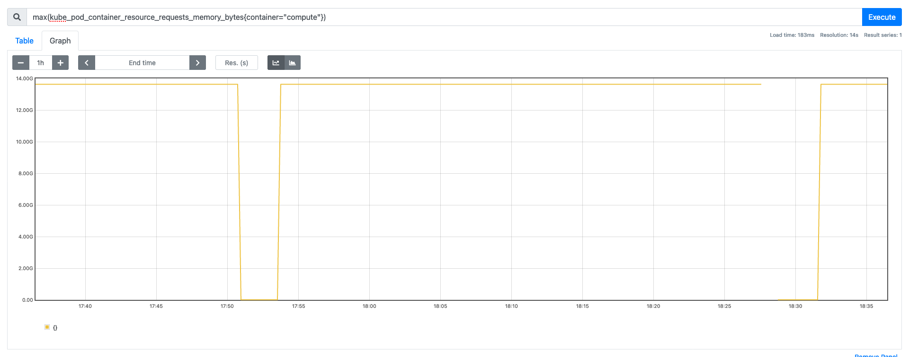

# Virtual Pod Autoscaler Recommender Rewrite

Crash loops due to spike in pod resource usage is an observed behaviour for targets autoscaled by vertical pod autoscaler.
This document proposes different solutions for resource recommendation by virtual pod autoscaler to handle spike usage.

_Comment: It might be good to either move this file to a subdirectory containing the proposal name (some thing about the spike and crash handling perhaps) or at least rename this file along the same lines._

## Problem
The current VPA recommender has the following problems which calls for enhancement in the recommending scheme for the VPA to try and auto-heal a component that go into crash loops due to spikes in resource usage.

1. Current VPA recommender implementation considers historic usage of resources by a pod for recommending scale of memory and CPU. This method is not efficient in handling spike in resources usage. When a spike occurs, the recommender lacks information about it in historic usage to bump up the resources and scale up. This can result in frequent component outages.
2. Stagnant CPU recommendations w.r.t increasing limits during scale up and decreasing them during scale down scenarios.
3. OOM Kills and possible livenessProbe failures due to inefficient CPU and memory recommendation. One observation is that in a component that is in crash loop, memory recommendation is increased much more than CPU recommendations especially if OOMKills occur. But many a times, OOMKills occur due to CPU being throttled and recommending only memory scale up in such cases is not efficient.


_Comment: The picture doesn't convey the problem clearly. Any way the point can be conveyed pictorially? If not we can drop the picture, I think._

4. For both CPU and memory, the recommender suggests a percentile resource unit upgrade from the historical value of resource usage obtained from prometheus client. This does not take into account the current sudden bump in the resource which might be increasing rapidly (exponentially) over a short duration and might be outside any observed range captured in the history. VPA recommender does not suggest a better scale up and scale down for such spikes (it often recommends less than the current usage if limits are configured higher than the requests) resulting in crashes.





Please observe the CPU and memory hikes resulting in crash in the below graphs.





_Comment: The pictures don't show usage and container restarts. So, it doesn't convey the problem fully. Can you please add them? Also, it would be good to include the vpa_recommendation graphs (though the requests graphs pretty much have that information)._

## Goals
- Pluggable new recommender in place of existing VPA recommender.
- React better to CPU and memory usage spikes (especially, avoid recommending lower than resource usage)
- React better to crashloops and possibly achieve automatic recovery if the crashes are triggered by lack of resources
- Scale down faster if usage is consistently lower for some period of time (for the time-being configurable globally via CLI flags because we are re-using the VPA CRD)
- Optionally support recommendations in annotations so that this can be used in parallel with VPA recommender and compared by enhancing vpa-exporter to additionally export recommendations from the annotations.


## Current VPA Recommender Implementation
### Scale Up and Scale Down
_Comment: It might be good to add hyperlinks to existing code where applicable to make this section complete._
- A history of metrics for CPU and memory requests usage is obtained from prometheus for a history length of 8 days
- Resource requests metrics for CPU and memory are obtained for each container in a pod from the prometheus client
  - _Comment: This is not entirely true. The information is retrieved from prometheus client only for initialization on VPA recommender restart and that too if it is enabled via a CLI flag. If it is disabled, the information is retrieved from the `VerticalPodAutoscalerCheckpoint` resources. By default, this information is there in memory if the container didn't restart._
- The history obtained is initialized with the recommender to start estimating the target, lower and upper bounds for the containers, and there by the pods
- Target Estimator, Lower Bound Requests and Upper Bound Requests are the three main estimations we determine using recommender
  - _Comment: It will be good to investigate and add the details for UncappedTarget just to be complete._
- A percentile value for each of these estimators are set as follows
  - 0.9 percentile for target CPU and Memory
  - 0.5 for lower bound requests of CPU and Memory
  - 0.95 for upper bound requests of CPU and Memory
- For Target Estimator we only recommend Percentile Estimation with a configurable safety margin of (by default 15%)
- An exponential variation in the lower bound requests, upper bound requests which is determined by history of metrics monitored and pod life span. There is a "confidence" value on which the entire resource scaling is determined.
- For lower bound and upper bound estimation a configurable safety margin (by default 15%) is applied
- The current lower bound and upper bound estimation formula is as follows
```
scaledResource = originalResource * (1 + 1/confidence)^exponent

confidence = (LastSampleTimeStart - FirstSampleTimeStart) / (no. of hours per day i.e 24)
```

Where,
- **scaledResource**  : newly scaled integer value of the amount of the 
                    resource  (CPU or Memory)
- **originalResource**: current integer value of the amount of the
                    resource (CPU or Memory)
- **confidence**      : An non-negative integer number that heuristically measures 
                    how much confidence the history aggregated in the AggregateContainerState provides. For a workload producing a steady stream of samples over N days at the rate of 1 sample per minute, this metric is equal to N. It is calcualted as the total count of samples and the time between the first and the last sample 
- **exponent**        : A non-zero float exponent value which is determined by the 
                    targetEstimator, lowedBoundEstimator or upperBoundEstimator. Each of these estimators are set through percentile estimations. targetEstimator is set to percentileEstimator while lowerBoundEstimator and upperBoundEstimator are set as confidence multipliers. For lowerBoundEstimator the exponent is set to -2 and for upperBoundEstimator it is set to +1

## Proposal

To address the concerns mentioned we are proposing this change in the recommendation engine of VPA recommender for autoscaler component.

#### Scale Up:
Doubling of resources based on current resource usage

_Comment: This section might be more readable as bullet points or just a paragraph._
  1. Today we depend on the resource requests history from prometheus client for a history length of 8 days (default)
  2. Instead, we could obtain current and past 10 minutes usage from prometheus client to get a nearest estimate of how much requests for resources is a pod making
  3. In the event of a spike in resource, we can recommend the target estimator, lower bound and upper bound estimator for requests as double the current resource usage obtained from prometheus
     - _Comment: Only target recommendation as double the current usage. The lower and upper bounds should be based on the target recommendation and should be related to the current usage only indirectly via the target recommendation._
  4. This will ensure handling the spike as it is dependent on the current usage than a hysteresis of resource usage pattern and doubling will react exponentially to a potentially exponential spike in resouce usage.

_Comment: The following section is about additional handling for crash loop cases. A couple of sentences about that and why just the doubling above may not be enough would set the context for the discussion that follows._

  We consider the following 3 variables (temporary names) no_of_crashes, last_crash_count_recorded_time, time_length_for_crash_check. We can set a no_of_crashes to 3 as the default value. If there is a resource crunch even after bumping one of CPU or memory based on current usage and has resulted in crashes, no_of_crashes serves a threshold beyond which both resources are to be scaled up irrespective of current usage consumption.
  Example: Let's say we recommended the memory doubling but had constant crashes for more than 3 times. Then we get into else condition and double both memory and CPU irrespective of whatever the recommendation for individual resource is.

#### Scale Down:
Scale down to a variable between 1 and 2 times the local maxima within a time window

_Comment: It might be good to mention the other possiblly relevant variables (even already existing onces in VPA recommender) here and how they are used/applied. E.g. scaling interval, scale down stabilization, scale down monitoring time window, scale down multiple or scale down safety margin)._

  1. Two new variables called scale_down_multiple (default to 1.2), scale_down_monitor_time_window (default to 1 hour) are used.
  2. We find the local maxima w.r.t resource usage within scale_down_monitor_time_window.
  3. We only scale down to `scale_down_multiple` times the maximum resource usage recorded within `scale_down_monitor_time_window`.
  4. `1 < scale_down_multiple < 2` (defaulted to 1.2). This ensures we always scale down to, slightly higher than previously seen highest resource usage within the time window but also lesser than scale up limit of doubling.
  Note: It could also be given as a best practise to ensure `1 < scale_down_mutliple < 1.5` so that we do not over provision the resources while scaling down. As the parameter scale_down_multiple is configurable between 1 and 2, there is room for trial and error and eventually arrive at a custom combination of parmater values for each component based on their usage of VPA.
     - _Comment: This can be called scale down safety margin (in percentage) which automatically keeps the multiple between 1 and 2._
  5. It also is crucial to scale down stepwise with shorter time windows. This ensures:
      1. Scale Down is gradual and does not vary drastically unlike percentile method during spike on and spike off events
      2. Scale Down is always done with nearest local maxima of resource usage which ensures we are not unncessarily taking history into account to avoid over or under provision resources.

_Comment: Just a nice to have. It would be awesome if we can have tentative charts of what the recommendations would look like with the proposed approach for the same cases mentioned in the problems section and how it would solve the problems seen there._

_Comment: Also, perhaps a section on concerns/limitations and how they can either be mitigated or are acceptable anyway (for example, double is too generous etc.)_
